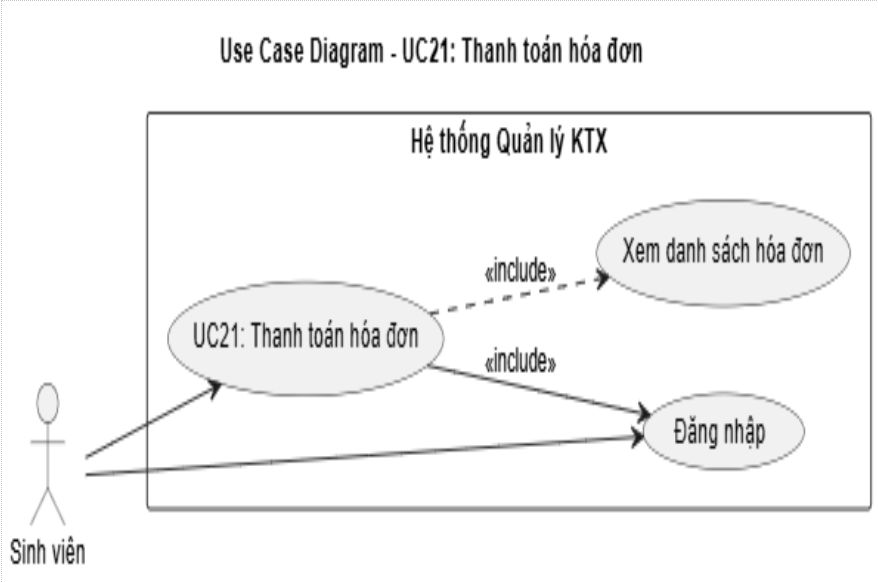
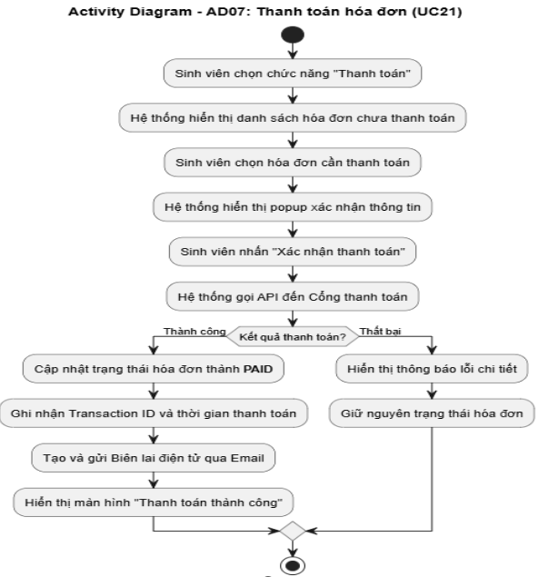
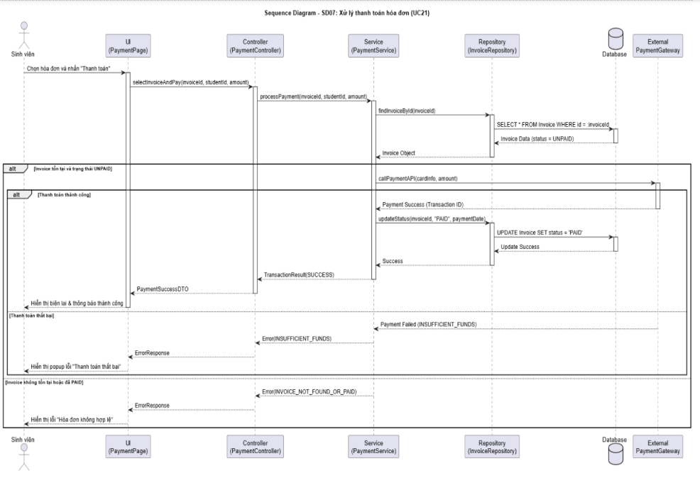
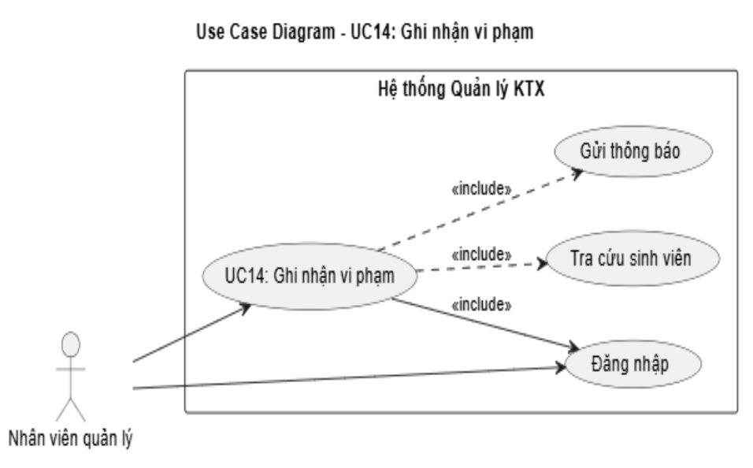
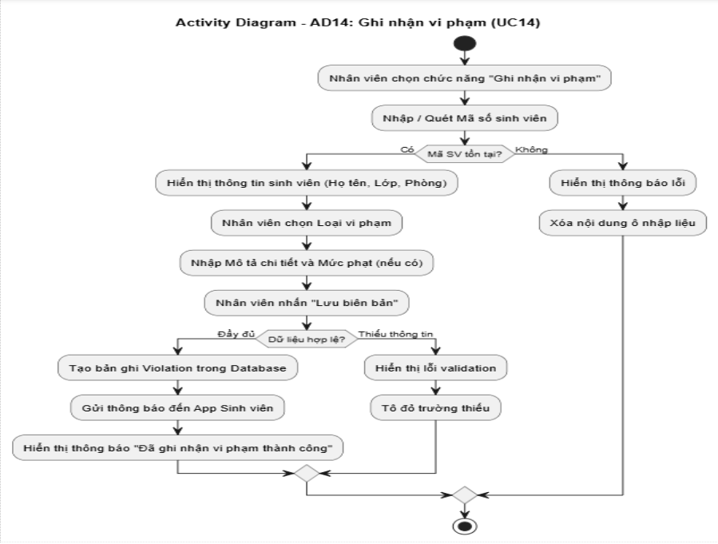
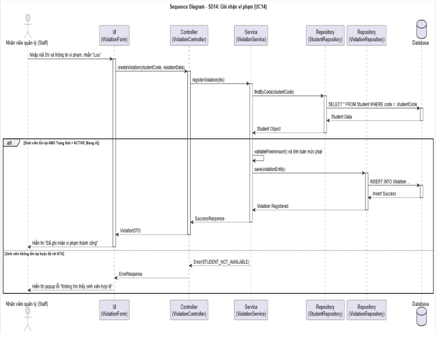
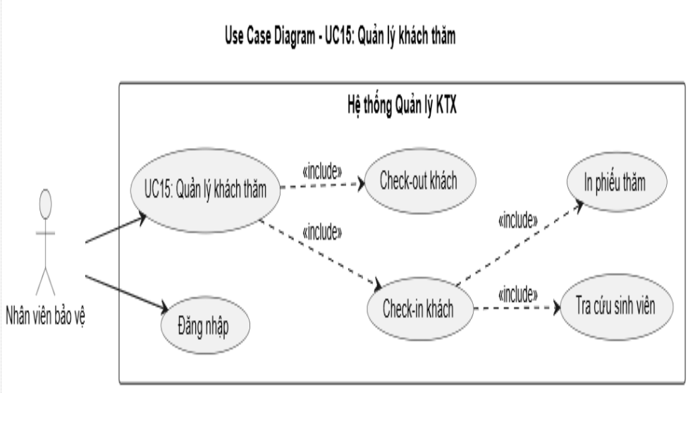
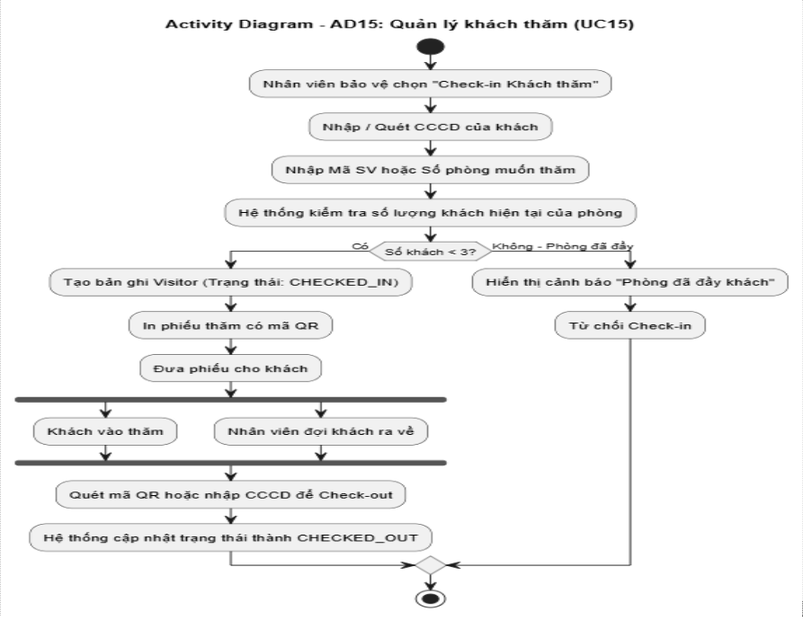
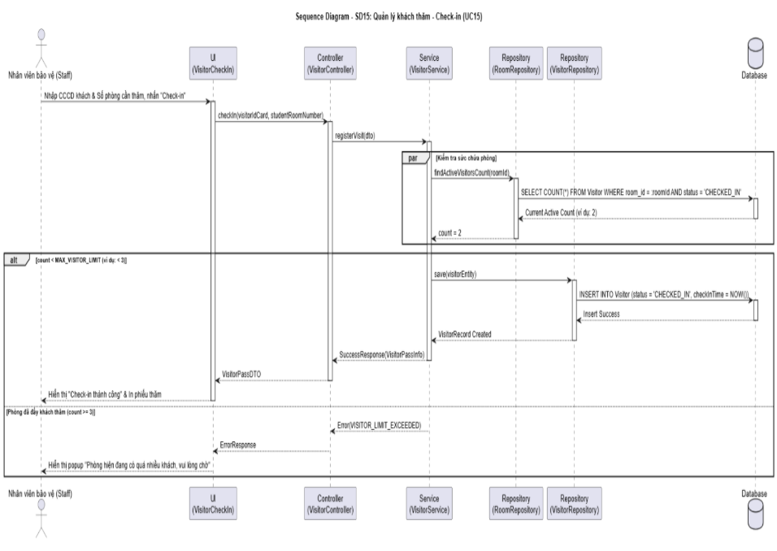

# 📋 BÁO CÁO UML - NHÓM VẬN HÀNH & THANH TOÁN
## Thành viên thực hiện: ĐỖ QUANG HUY
## Ngày hoàn thành: 22/04/2026

---

## 📌 MỤC LỤC
1. [UC21: Thanh toán hóa đơn](#1-uc21-thanh-toán-hóa-đơn)
2. [UC14: Ghi nhận vi phạm](#2-uc14-ghi-nhận-vi-phạm)
3. [UC15: Quản lý khách thăm](#3-uc15-quản-lý-khách-thăm)

---

# 1. UC21: THANH TOÁN HÓA ĐƠN

## 1.1. Use Case Diagram

## 1.2. Đặc tả Use Case

| Thuộc tính | Nội dung |
|:---|:---|
| Tên Usecase | Thanh toán hóa đơn |
| Mức | Mức người dùng |
| Tác nhân chính | Sinh viên |
| Các bên liên quan | Sinh viên, Nhân viên quản lý, Cổng thanh toán |
| Mục tiêu | Cho phép sinh viên xem danh sách hóa đơn còn nợ và thực hiện thanh toán trực tuyến |
| Tiền điều kiện | Sinh viên đã đăng nhập, có ít nhất một hóa đơn ở trạng thái UNPAID |
| Kích hoạt | Sinh viên chọn menu "Thanh toán" hoặc nhấp vào thông báo "Bạn có hóa đơn chưa thanh toán" |
| Đảm bảo tối thiểu | Hệ thống ghi nhận giao dịch thất bại và giữ nguyên trạng thái hóa đơn |
| Đảm bảo thành công | Hóa đơn chuyển sang PAID, sinh viên nhận biên lai điện tử qua Email |
| Luồng chính | 1. Sinh viên truy cập màn hình "Danh sách hóa đơn" 2. Hệ thống gọi API lấy danh sách hóa đơn UNPAID 3. Hệ thống hiển thị danh sách: Mã hóa đơn, Kỳ thanh toán, Tổng tiền, Hạn thanh toán 4. Sinh viên chọn một hóa đơn từ danh sách 5. Hệ thống hiển thị popup Xác nhận thanh toán 6. Sinh viên nhấn "Xác nhận thanh toán" 7. Hệ thống gửi yêu cầu đến Cổng thanh toán 8. Cổng thanh toán xử lý và trả về kết quả Thành công 9. Hệ thống cập nhật trạng thái hóa đơn thành PAID 10. Hệ thống ghi nhận Transaction ID và thời gian thanh toán 11. Hệ thống tạo và gửi Biên lai điện tử qua Email 12. Hiển thị màn hình "Thanh toán thành công" |
| Luồng ngoại lệ | **2A. Không có hóa đơn UNPAID** 1. Hệ thống kiểm tra và phát hiện danh sách hóa đơn UNPAID rỗng 2. Hệ thống hiển thị thông báo: "Bạn không có hóa đơn nào cần thanh toán." 3. Hệ thống ẩn nút "Thanh toán" hoặc vô hiệu hóa chức năng 4. Kết thúc  **6A. Hóa đơn đã được thanh toán** 1. Sinh viên nhấn "Xác nhận thanh toán" 2. Hệ thống kiểm tra lại trạng thái hóa đơn 3. Phát hiện hóa đơn đã chuyển sang PAID hoặc PROCESSING 4. Hệ thống hiển thị thông báo: "Hóa đơn này đã được thanh toán hoặc đang được xử lý. Vui lòng kiểm tra lại." 5. Hệ thống tự động refresh danh sách hóa đơn 6. Quay lại bước 3  **8A. Số dư không đủ** 1. Cổng thanh toán trả về mã lỗi INSUFFICIENT_FUNDS 2. Hệ thống nhận phản hồi và dừng quá trình thanh toán 3. Hệ thống không cập nhật trạng thái hóa đơn 4. Hệ thống hiển thị thông báo: "Thanh toán thất bại: Số dư tài khoản không đủ." 5. Ghi log lỗi giao dịch 6. Quay lại bước 5  **8B. Thẻ bị từ chối / Hết hạn** 1. Cổng thanh toán trả về mã lỗi CARD_DECLINED hoặc CARD_EXPIRED 2. Hệ thống nhận phản hồi và dừng quá trình thanh toán 3. Hệ thống hiển thị thông báo: "Thanh toán thất bại: Thẻ của bạn bị từ chối hoặc đã hết hạn." 4. Ghi log lỗi giao dịch 5. Quay lại bước 5  **8C. Hết thời gian chờ (Timeout)** 1. Sau 30 giây không nhận được phản hồi từ Cổng thanh toán 2. Hệ thống dừng yêu cầu và coi giao dịch đang treo 3. Hệ thống cập nhật trạng thái hóa đơn thành PENDING_PAYMENT 4. Hệ thống hiển thị thông báo: "Giao dịch đang chờ xử lý từ ngân hàng. Vui lòng kiểm tra lại sau 5 phút." 5. Ghi log cảnh báo với mã PAYMENT_TIMEOUT 6. Gửi email thông báo cho Staff để kiểm tra đối soát thủ công 7. Kết thúc  **9A. Lỗi Database sau khi thanh toán thành công** 1. Cổng thanh toán đã trả về Thành công và trừ tiền sinh viên 2. Hệ thống gọi updateInvoiceStatus() nhưng không thể kết nối Database 3. Hệ thống ghi log CRITICAL ERROR với Transaction ID và Invoice ID 4. Hệ thống lưu tạm thông tin giao dịch vào bộ nhớ đệm để retry sau 5. Hệ thống hiển thị thông báo: "Hệ thống đang gặp sự cố kỹ thuật. Giao dịch của bạn đã được ngân hàng ghi nhận. Vui lòng liên hệ quản lý KTX để được xác nhận thủ công." 6. Gửi cảnh báo khẩn cấp đến Slack/Email của đội ngũ Staff 7. Kết thúc |
| Quy tắc nghiệp vụ | BR01: Mỗi hóa đơn chỉ được thanh toán 1 lần, không cho phép thanh toán lại hóa đơn đã PAID BR02: Số tiền thanh toán phải khớp chính xác với totalAmount của hóa đơn BR03: Nếu thanh toán sau ngày dueDate, hệ thống tự động tính thêm phí phạt lateFee vào lần tạo hóa đơn tiếp theo |

## 1.3. Activity Diagram - AD07

## 1.4. Sequence Diagram - SD07

---

# 2. UC14: GHI NHẬN VI PHẠM

## 2.1. Use Case Diagram

## 2.2. Đặc tả Use Case

| Thuộc tính | Nội dung |
|:---|:---|
| Tên Usecase | Ghi nhận vi phạm |
| Mức | Mức nghiệp vụ |
| Tác nhân chính | Nhân viên quản lý (Staff) |
| Các bên liên quan | Nhân viên quản lý, Sinh viên, Ban quản lý KTX |
| Mục tiêu | Ghi lại hành vi vi phạm nội quy KTX của sinh viên vào hệ thống để làm cơ sở đánh giá hạnh kiểm và xử phạt |
| Tiền điều kiện | Nhân viên đã đăng nhập với quyền STAFF, danh mục loại vi phạm đã được cấu hình |
| Kích hoạt | Nhân viên chọn chức năng "Quản lý vi phạm" → "Ghi nhận mới" |
| Đảm bảo tối thiểu | Thông báo lỗi nếu không tìm thấy sinh viên hoặc nhập thiếu dữ liệu, không lưu bản ghi sai lệch |
| Đảm bảo thành công | Bản ghi vi phạm được lưu vào Database, sinh viên nhận được thông báo đẩy về vi phạm mới |
| Luồng chính | 1. Nhân viên truy cập màn hình "Ghi nhận vi phạm" 2. Nhân viên nhập hoặc quét Mã số sinh viên vào ô tìm kiếm 3. Hệ thống truy vấn Database và hiển thị thông tin cơ bản: Họ tên, Ngày sinh, Lớp, Phòng đang ở 4. Nhân viên chọn Loại vi phạm từ dropdown 5. Nhân viên nhập Mô tả chi tiết (bắt buộc) và mức Phạt tiền (tùy chọn) 6. Nhân viên nhấn nút "Lưu biên bản" 7. Hệ thống kiểm tra dữ liệu đầu vào hợp lệ 8. Hệ thống tạo bản ghi mới trong bảng Violation với thời gian vi phạm là NOW() 9. Hệ thống gửi Thông báo đẩy đến tài khoản App của Sinh viên vi phạm 10. Hệ thống hiển thị thông báo "Đã ghi nhận vi phạm thành công" |
| Luồng ngoại lệ | **3A. Mã sinh viên không tồn tại** 1. Hệ thống truy vấn Database nhưng không tìm thấy sinh viên có mã đã nhập 2. Hệ thống trả về kết quả rỗng 3. Hệ thống hiển thị thông báo lỗi: "Không tìm thấy sinh viên có mã này trong hệ thống." 4. Hệ thống tự động xóa nội dung ô nhập liệu và đặt con trỏ vào đó 5. Quay lại bước 2  **3B. Sinh viên không còn nội trú (Đã Check-out)** 1. Hệ thống truy vấn tìm thấy sinh viên nhưng status = CHECKED_OUT hoặc GRADUATED 2. Hệ thống vẫn hiển thị thông tin cơ bản nhưng làm mờ các trường nhập liệu 3. Hệ thống hiển thị cảnh báo: "Sinh viên này đã rời khỏi KTX. Không thể ghi nhận vi phạm mới." 4. Hệ thống vô hiệu hóa nút "Lưu biên bản" 5. Kết thúc  **4A. Danh sách loại vi phạm rỗng (Chưa cấu hình)** 1. Hệ thống gọi API lấy danh sách ViolationType nhưng trả về mảng rỗng 2. Hệ thống hiển thị dropdown bị vô hiệu hóa với dòng chữ "Chưa có loại vi phạm nào" 3. Hệ thống hiển thị thông báo: "Không thể tải danh sách loại vi phạm. Vui lòng liên hệ Admin để cấu hình." 4. Vô hiệu hóa toàn bộ form và nút "Lưu biên bản" 5. Kết thúc  **6A. Chưa chọn Loại vi phạm** 1. Nhân viên nhấn "Lưu biên bản" nhưng chưa chọn giá trị từ dropdown Violation Type 2. Hệ thống phát hiện trường này đang để trống 3. Hệ thống dừng yêu cầu lưu 4. Hệ thống tô viền đỏ dropdown Loại vi phạm và hiển thị thông báo: "Vui lòng chọn Loại vi phạm." 5. Quay lại bước 4  **6B. Chưa nhập Mô tả chi tiết** 1. Nhân viên nhấn "Lưu biên bản" nhưng để trống trường Description 2. Hệ thống phát hiện trường này rỗng hoặc chỉ chứa khoảng trắng 3. Hệ thống dừng yêu cầu lưu 4. Hệ thống tô viền đỏ textarea Mô tả và hiển thị thông báo: "Vui lòng nhập mô tả chi tiết về hành vi vi phạm." 5. Quay lại bước 5  **6C. Mức phạt vượt quá giới hạn quy định** 1. Nhân viên nhập mức phạt fineAmount > maxFineAmount được quy định cho loại vi phạm đã chọn 2. Hệ thống kiểm tra và phát hiện vi phạm quy tắc BR02 3. Hệ thống dừng yêu cầu lưu 4. Hệ thống tô viền đỏ ô nhập Mức phạt và hiển thị thông báo: "Mức phạt vượt quá giới hạn cho phép." 5. Quay lại bước 5  **8A. Lỗi kết nối Database khi lưu bản ghi** 1. Nhân viên nhấn "Lưu biên bản" và dữ liệu đã hợp lệ 2. Hệ thống gọi INSERT INTO Violation nhưng không thể kết nối đến Database 3. Hệ thống bắt lỗi SQLException hoặc ConnectionTimeoutException 4. Hệ thống hiển thị thông báo lỗi: "Lỗi hệ thống, không thể lưu biên bản. Vui lòng thử lại sau." 5. Hệ thống giữ nguyên toàn bộ dữ liệu đã nhập trên form 6. Ghi log lỗi chi tiết để IT kiểm tra 7. Quay lại bước 5 |
| Quy tắc nghiệp vụ | BR01: Không thể ghi nhận vi phạm cho sinh viên đã Check-out khỏi KTX BR02: Mức phạt tiền (nếu có) không được vượt quá maxFineAmount được quy định cho từng loại vi phạm BR03: Nhân viên chỉ có thể sửa hoặc xóa biên bản vi phạm trong vòng 24 giờ kể từ thời điểm tạo |

## 2.3. Activity Diagram - AD14

## 2.4. Sequence Diagram - SD14

---

# 3. UC15: QUẢN LÝ KHÁCH THĂM

## 3.1. Use Case Diagram

## 3.2. Đặc tả Use Case

| Thuộc tính | Nội dung |
|:---|:---|
| Tên Usecase | Quản lý khách thăm |
| Mức | Mức nghiệp vụ |
| Tác nhân chính | Nhân viên bảo vệ (Security Staff) |
| Các bên liên quan | Nhân viên bảo vệ, Sinh viên, Khách thăm, Ban quản lý |
| Mục tiêu | Kiểm soát lượng người ra vào KTX, ghi nhận thông tin khách đến thăm sinh viên và giới hạn số lượng khách/phòng để đảm bảo an ninh |
| Tiền điều kiện | Nhân viên bảo vệ đã đăng nhập vào hệ thống, trong khung giờ cho phép thăm (07:00 - 22:30) |
| Kích hoạt | Có khách đến quầy bảo vệ và yêu cầu vào thăm sinh viên. Nhân viên chọn chức năng "Check-in Khách thăm" |
| Đảm bảo tối thiểu | Từ chối check-in nếu phòng đã đầy khách hoặc sinh viên không tồn tại |
| Đảm bảo thành công | Tạo bản ghi Visitor với trạng thái CHECKED_IN, in phiếu thăm có mã QR cho khách |
| Luồng chính | 1. Nhân viên bảo vệ truy cập màn hình "Quản lý khách thăm" → chọn tab "Check-in" 2. Nhân viên yêu cầu CCCD của khách và quét hoặc nhập tay số CCCD/Số hộ chiếu vào hệ thống 3. Hệ thống tự động điền thông tin cá nhân của khách từ API định danh 4. Nhân viên nhập Mã số sinh viên hoặc chọn Số phòng mà khách muốn thăm 5. Hệ thống kiểm tra số lượng khách hiện tại đang CHECKED_IN của phòng đó 6. (Điều kiện: Số khách hiện tại < 3) Hệ thống tạo bản ghi Visitor với thông tin: visitorIdCard, studentId, roomId, checkInTime = NOW(), status = CHECKED_IN 7. Hệ thống hiển thị thông báo "Check-in thành công" và tự động in phiếu thăm có mã QR 8. Nhân viên đưa phiếu thăm cho khách và yêu cầu khách giữ phiếu để Check-out 9. (Luồng Check-out) Nhân viên quét mã QR trên phiếu thăm hoặc tìm kiếm theo CCCD và nhấn "Check-out" 10. Hệ thống cập nhật checkOutTime = NOW() và status = CHECKED_OUT cho bản ghi Visitor tương ứng |
| Luồng ngoại lệ | **2A. CCCD không hợp lệ (Sai định dạng)** 1. Nhân viên nhập số CCCD không đúng định dạng 2. Hệ thống kiểm tra validation phía client 3. Hệ thống tô viền đỏ ô nhập liệu và hiển thị thông báo: "Số CCCD không hợp lệ. Vui lòng nhập đúng 12 chữ số." 4. Hệ thống vô hiệu hóa nút "Tiếp tục" 5. Quay lại bước 2  **2B. CCCD đã hết hạn** 1. Hệ thống gọi API định danh và nhận được thông tin ngày hết hạn của CCCD 2. Hệ thống so sánh ngày hết hạn với ngày hiện tại 3. Phát hiện CCCD đã hết hạn 4. Hệ thống hiển thị cảnh báo: "CCCD này đã hết hạn sử dụng. Không thể Check-in." 5. Hệ thống vô hiệu hóa nút "Tiếp tục" 6. Kết thúc  **2C. Khách thăm đang trong Danh sách đen (Blacklist)** 1. Hệ thống kiểm tra số CCCD trong bảng Blacklist 2. Phát hiện khách này từng vi phạm nghiêm trọng và bị cấm vào KTX 3. Hệ thống hiển thị cảnh báo màu đỏ: "CẢNH BÁO: Khách này nằm trong danh sách cấm vào KTX. Vui lòng từ chối và báo cho Quản lý!" 4. Hệ thống vô hiệu hóa toàn bộ form check-in 5. Gửi thông báo đẩy đến điện thoại của Staff quản lý ca trực 6. Kết thúc  **4A. Mã sinh viên không tồn tại** 1. Nhân viên nhập mã sinh viên không có trong hệ thống 2. Hệ thống truy vấn Database và trả về kết quả rỗng 3. Hệ thống hiển thị thông báo: "Không tìm thấy sinh viên với mã này." 4. Hệ thống xóa nội dung ô nhập liệu và đặt con trỏ vào đó 5. Quay lại bước 4  **4B. Sinh viên đã Check-out khỏi KTX** 1. Hệ thống tìm thấy sinh viên nhưng status = CHECKED_OUT 2. Hệ thống hiển thị thông báo: "Sinh viên này không còn cư trú tại KTX. Không thể đăng ký thăm." 3. Hệ thống xóa thông tin sinh viên đã hiển thị và đặt lại form 4. Quay lại bước 4  **4C. Số phòng nhập vào không tồn tại** 1. Nhân viên chọn cách nhập theo Số phòng thay vì Mã SV 2. Nhân viên nhập số phòng không có trong danh sách phòng KTX 3. Hệ thống kiểm tra và không tìm thấy phòng 4. Hệ thống hiển thị thông báo: "Số phòng không tồn tại. Vui lòng kiểm tra lại." 5. Xóa nội dung ô nhập liệu 6. Quay lại bước 4  **5A. Phòng đã đầy khách thăm (Limit Exceeded)** 1. Hệ thống truy vấn số lượng khách đang CHECKED_IN của phòng 2. Kết quả trả về >= 3 3. Hệ thống dừng thao tác Check-in 4. Hệ thống hiển thị popup cảnh báo: "Phòng này hiện đang có 3 khách thăm. Vui lòng yêu cầu khách chờ cho đến khi có khách rời đi." 5. Hệ thống không tạo bản ghi Visitor mới 6. Hệ thống làm mới form để sẵn sàng cho lượt khách tiếp theo 7. Kết thúc  **5B. Ngoài khung giờ cho phép thăm** 1. Nhân viên cố gắng check-in sau 22:30 2. Hệ thống kiểm tra currentTime so với VISITING_END_TIME 3. Hệ thống phát hiện ngoài giờ cho phép 4. Hệ thống hiển thị thông báo: "Đã hết giờ thăm (22:30). Không thể tạo phiếu Check-in mới." 5. Hệ thống vô hiệu hóa nút "Check-in" 6. Kết thúc  **9A. Check-out nhưng không tìm thấy bản ghi Check-in tương ứng** 1. Nhân viên quét mã QR khi khách ra về 2. Hệ thống tìm kiếm bản ghi Visitor với visitorId tương ứng và status = CHECKED_IN 3. Không tìm thấy (có thể đã bị Check-out tự động lúc 23:00 hoặc do lỗi dữ liệu) 4. Hệ thống hiển thị thông báo: "Không tìm thấy phiếu thăm đang hoạt động. Khách có thể đã được Check-out tự động." 5. Kết thúc  **10A. Lỗi kết nối Database khi cập nhật Check-out** 1. Nhân viên quét mã QR và hệ thống tìm thấy bản ghi hợp lệ 2. Hệ thống gọi UPDATE Visitor SET checkOutTime = NOW(), status = 'CHECKED_OUT' nhưng mất kết nối DB 3. Hệ thống bắt lỗi và hiển thị: "Lỗi hệ thống, không thể cập nhật Check-out. Vui lòng thử lại." 4. Hệ thống ghi log lỗi với visitorId 5. Hệ thống giữ nguyên màn hình và cho phép nhân viên thử lại thao tác Check-out 6. Quay lại bước 9 |
| Quy tắc nghiệp vụ | BR01: Mỗi phòng chỉ được phép có tối đa 3 khách vào thăm cùng một thời điểm BR02: Khung giờ cho phép khách thăm: 07:00 - 22:30 hàng ngày BR03: Khách thăm không được phép ở lại qua đêm. Hệ thống tự động chạy Batch Job lúc 23:00 để Check-out tất cả khách còn trạng thái CHECKED_IN BR04: Một khách chỉ được phép thăm 1 phòng tại một thời điểm |

## 3.3. Activity Diagram - AD15

## 3.4. Sequence Diagram - SD15

---

# 📊 TỔNG KẾT CÔNG VIỆC - HUY

| Nhiệm vụ | Use Case | Activity | Sequence | Trạng thái |
|:---|:---:|:---:|:---:|:---:|
| **Thanh toán** | UC21 | AD07 | SD07 | ✅ **HOÀN THÀNH** |
| **Vi phạm** | UC14 | AD14 | SD14 | ✅ **HOÀN THÀNH** |
| **Khách thăm** | UC15 | AD15 | SD15 | ✅ **HOÀN THÀNH** |

---

