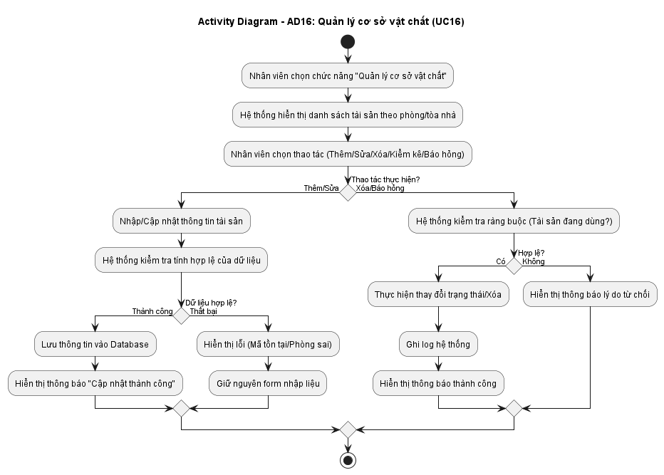
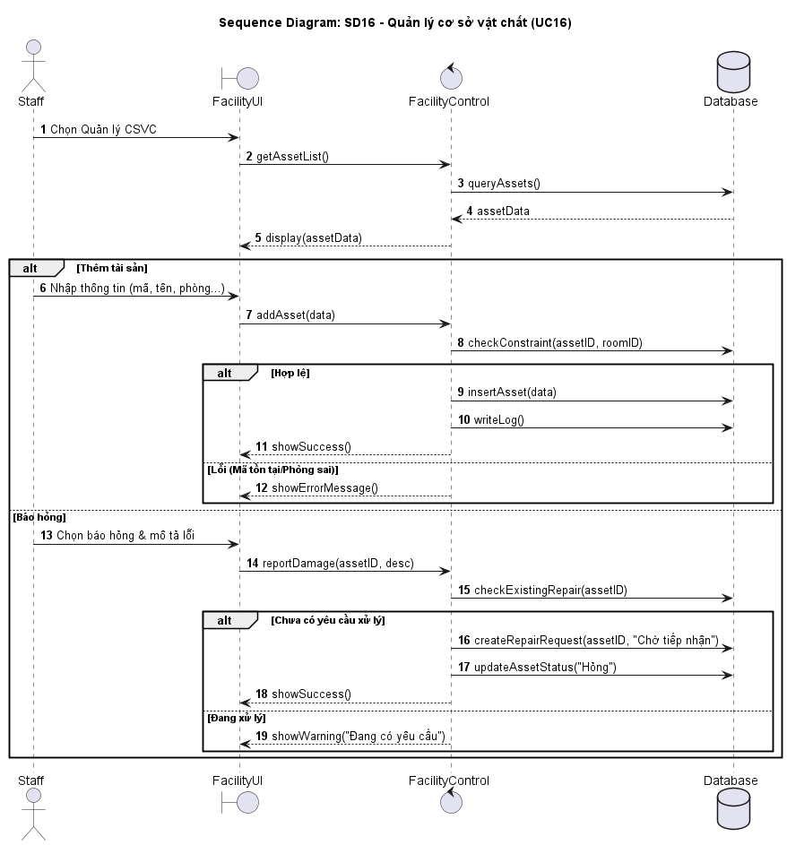

# 📋 BÁO CÁO UML - NHÓM KỸ THUẬT & HỆ THỐNG PHỤ TRỢ
## Thành viên thực hiện: LÊ THỊ CẨM TÚ

---

## 📌 MỤC LỤC
1. [UC16: Quản lý cơ sở vật chất](#1-uc16-quản-lý-cơ-sở-vật-chất)
2. [UC22: Tạo yêu cầu sửa chữa](#2-uc22-tạo-yêu-cầu-sửa-chữa)
3. [UC24: Tiếp nhận yêu cầu sửa chữa](#3-uc24-tiếp-nhận-yêu-cầu-sửa-chữa)
4. [UC25: Xử lý sự cố kỹ thuật](#4-uc25-xử-lý-sự-cố-kỹ-thuật)
5. [UC26: Cập nhật trạng thái sửa chữa](#5-uc26-cập-nhật-trạng-thái-sửa-chữa)

---

# 1. UC16: QUẢN LÝ CƠ SỞ VẬT CHẤT

## 1.1. Use Case Diagram

## 1.2. Đặc tả Use Case

| Thuộc tính | Nội dung |
|:---|:---|
| Tên Usecase | Quản lý cơ sở vật chất |
| Mức | Mức nghiệp vụ |
| Tác nhân chính | Nhân viên quản lý (Staff) |
| Các bên liên quan | Staff, Technician, Student, Hệ thống |
| Mục tiêu | Quản lý danh sách tài sản, thiết bị, vật dụng trong ký túc xá (thêm, sửa, xóa, kiểm kê, báo hỏng) |
| Tiền điều kiện | Staff đã đăng nhập thành công với quyền STAFF |
| Kích hoạt | Staff chọn chức năng "Quản lý cơ sở vật chất" từ menu chính |
| Đảm bảo tối thiểu | Dữ liệu tài sản được validate trước khi lưu, ghi log mọi thay đổi |
| Đảm bảo thành công | Tài sản được thêm/sửa/xóa/kiểm kê/báo hỏng đúng yêu cầu, cập nhật trạng thái chính xác |
| Luồng chính | 1. Staff đăng nhập vào hệ thống 2. Chọn menu "Quản lý cơ sở vật chất" 3. Hệ thống hiển thị danh sách tài sản theo phòng/tòa nhà 4. Staff chọn thao tác: Thêm/Sửa/Xóa/Kiểm kê/Báo hỏng 5. **Nếu Thêm**: Nhập thông tin (mã TS, tên, loại, phòng, ngày mua, tình trạng) → Lưu 6. **Nếu Sửa**: Chọn tài sản → Cập nhật thông tin → Lưu 7. **Nếu Xóa**: Chọn tài sản → Kiểm tra ràng buộc → Xóa nếu hợp lệ 8. **Nếu Kiểm kê**: Chọn phòng → Nhập số lượng thực tế → Đối chiếu → Cập nhật chênh lệch 9. **Nếu Báo hỏng**: Chọn tài sản → Nhập mô tả lỗi → Tự động tạo yêu cầu sửa chữa 10. Hệ thống xác nhận thành công và ghi log 11. Kết thúc |
| Luồng ngoại lệ | **5A. Mã tài sản đã tồn tại (khi thêm)** 1. Hệ thống kiểm tra thấy mã tài sản đã có trong database 2. Hệ thống hiển thị thông báo: "Mã tài sản đã tồn tại trong hệ thống" 3. Hệ thống tô viền đỏ trường Mã tài sản 4. Giữ nguyên form, quay lại bước nhập  **5B. Phòng không tồn tại** 1. Staff nhập mã phòng không hợp lệ 2. Hệ thống hiển thị thông báo: "Phòng không tồn tại trong hệ thống" 3. Quay lại bước nhập  **7A. Không thể xóa do tài sản đang được sử dụng** 1. Hệ thống kiểm tra thấy tài sản đang có mặt tại phòng có sinh viên ở 2. Hệ thống hiển thị thông báo: "Không thể xóa tài sản đang được sử dụng" 3. Hủy thao tác xóa, giữ nguyên danh sách 4. Kết thúc  **8A. Kiểm kê phát sinh chênh lệch** 1. Số lượng thực tế khác số lượng trong hệ thống 2. Hệ thống hiển thị báo cáo chênh lệch 3. Yêu cầu Staff nhập lý do chênh lệch (mất, hỏng, chuyển phòng...) 4. Staff xác nhận lý do 5. Hệ thống cập nhật lại số lượng thực tế và ghi log kiểm kê 6. Kết thúc  **9A. Tài sản đã có yêu cầu sửa chữa đang xử lý** 1. Staff chọn báo hỏng nhưng tài sản đã có yêu cầu sửa chữa trước đó chưa hoàn thành 2. Hệ thống hiển thị thông báo: "Tài sản đang có yêu cầu sửa chữa, không thể báo hỏng lại" 3. Hủy thao tác, giữ nguyên form 4. Kết thúc  **DB1. Lỗi kết nối Database** 1. Hệ thống không thể kết nối đến Database 2. Hệ thống hiển thị thông báo: "Lỗi hệ thống, vui lòng thử lại sau" 3. Ghi exception log để IT kiểm tra 4. Kết thúc |
| Quy tắc nghiệp vụ | BR01: Mỗi tài sản có mã duy nhất trong toàn hệ thống BR02: Không thể xóa tài sản đang được sử dụng tại phòng có sinh viên đang ở BR03: Kiểm kê bắt buộc phải có lý do khi phát sinh chênh lệch BR04: Báo hỏng tự động tạo yêu cầu sửa chữa với trạng thái "Chờ tiếp nhận" |

## 1.3. Activity Diagram - AD16

## 1.4. Sequence Diagram - SD16

