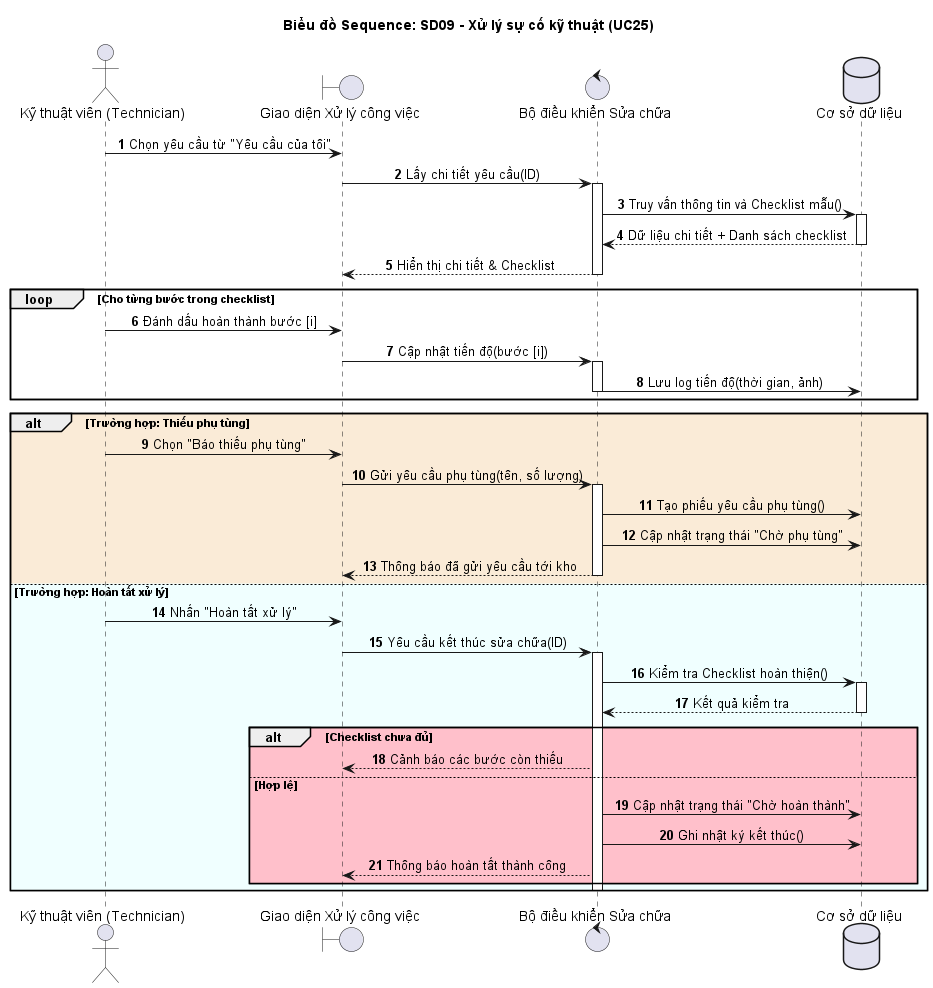

# 4. UC25: XỬ LÝ SỰ CỐ KỸ THUẬT

## 4.1. Use Case Diagram

## 4.2. Đặc tả Use Case

| Thuộc tính | Nội dung |
|:---|:---|
| Tên Usecase | Xử lý sự cố kỹ thuật |
| Mức | Mức người dùng |
| Tác nhân chính | Nhân viên kỹ thuật (Technician) |
| Các bên liên quan | Sinh viên, Nhân viên quản lý, Hệ thống |
| Mục tiêu | Nhân viên kỹ thuật thực hiện sửa chữa, cập nhật tiến độ và kết quả |
| Tiền điều kiện | Nhân viên kỹ thuật đã tiếp nhận yêu cầu (UC24), yêu cầu ở trạng thái "Đang xử lý" |
| Kích hoạt | Nhân viên kỹ thuật chọn yêu cầu đã tiếp nhận từ danh sách "Yêu cầu của tôi" |
| Đảm bảo tối thiểu | Mỗi bước sửa chữa được ghi nhận, có thể tạm dừng và tiếp tục sau |
| Đảm bảo thành công | Sự cố được xử lý hoàn chỉnh, sẵn sàng chuyển sang trạng thái "Chờ hoàn thành" |
| Luồng chính | 1. Hệ thống hiển thị chi tiết yêu cầu và checklist sửa chữa (theo loại tài sản) 2. Nhân viên kỹ thuật thực hiện từng bước sửa chữa 3. Sau mỗi bước, Nhân viên kỹ thuật tick chọn hoàn thành bước đó 4. Hệ thống lưu tiến độ (thời gian, nội dung, ảnh sau sửa nếu có) 5. Nếu phát sinh vấn đề, Nhân viên kỹ thuật ghi chú bổ sung vào nhật ký 6. Nhân viên kỹ thuật có thể chọn "Tạm dừng" để lưu tiến độ và xử lý yêu cầu khác 7. Khi hoàn thành tất cả các bước, Nhân viên kỹ thuật chọn "Hoàn tất xử lý" 8. Hệ thống kiểm tra checklist đã đầy đủ 9. Hệ thống cập nhật trạng thái thành "Chờ hoàn thành" 10. Kết thúc |
| Luồng ngoại lệ | **2A. Thiếu phụ tùng thay thế** 1. Nhân viên kỹ thuật phát hiện cần phụ tùng nhưng không có sẵn trong kho 2. Nhân viên kỹ thuật chọn "Báo thiếu phụ tùng" 3. Hệ thống hiển thị form yêu cầu phụ tùng 4. Nhân viên kỹ thuật nhập thông tin: tên phụ tùng, số lượng, lý do 5. Hệ thống tạo phiếu yêu cầu phụ tùng, gửi cho Nhân viên quản lý kho 6. Hệ thống cập nhật trạng thái yêu cầu thành "Chờ phụ tùng" 7. Chờ cấp phát phụ tùng (có thể thông báo qua hệ thống) 8. Sau khi có phụ tùng, Nhân viên kỹ thuật chọn "Tiếp tục xử lý" 9. Quay lại bước 3  **2B. Sự cố vượt quá khả năng xử lý** 1. Nhân viên kỹ thuật ghi nhận sự cố quá phức tạp, cần chuyên gia hoặc đơn vị ngoài 2. Nhân viên kỹ thuật chọn "Yêu cầu hỗ trợ" 3. Hệ thống tạo ticket nâng cấp (escalation) 4. Hệ thống gửi thông báo cho trưởng bộ phận kỹ thuật 5. Hệ thống cập nhật trạng thái yêu cầu thành "Chờ hỗ trợ" 6. Chờ phân công hỗ trợ 7. Sau khi có hỗ trợ, Nhân viên kỹ thuật tiếp tục xử lý 8. Quay lại bước 3  **8A. Checklist chưa hoàn thành khi báo cáo** 1. Nhân viên kỹ thuật chọn "Hoàn tất xử lý" nhưng checklist còn bước chưa tick 2. Hệ thống hiển thị thông báo: "Chưa hoàn thành các bước: [danh sách bước còn thiếu]" 3. Hệ thống tô màu đỏ các bước chưa hoàn thành 4. Yêu cầu Nhân viên kỹ thuật hoàn thành các bước còn thiếu 5. Quay lại bước 3  **9A. Lỗi kết nối Database khi lưu tiến độ** 1. Nhân viên kỹ thuật cập nhật tiến độ nhưng không thể lưu vào database 2. Hệ thống hiển thị thông báo: "Lỗi hệ thống, không thể lưu tiến độ. Vui lòng thử lại." 3. Ghi exception log 4. Giữ nguyên dữ liệu trên form, cho phép Nhân viên kỹ thuật thử lại |
| Quy tắc nghiệp vụ | BR01: Mỗi loại tài sản có một checklist sửa chữa riêng do Admin cấu hình BR02: Nhân viên kỹ thuật chỉ có thể hoàn tất xử lý khi tất cả các bước trong checklist đã được tick hoàn thành BR03: Mọi thay đổi trạng thái đều được ghi vào bảng repair_logs |

## 4.3. Activity Diagram - AD09

## 4.4. Sequence Diagram - SD09

